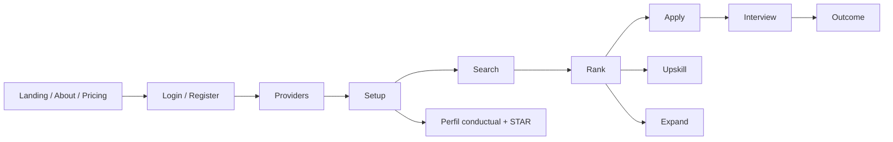

# Open Ai Jobs Search — Frontend

> **Open Ai Jobs Search** es una estación de trabajo para automatizar tu búsqueda de empleo de principio a fin: desde conectar tu proveedor de IA hasta generar CV/cover letter optimizados para ATS, preparar entrevistas y trackear resultados.

Este repositorio es **el frontend** (Next.js 15 + React 19 + Tailwind CSS v4). Toda la lógica de negocio vive en un backend FastAPI separado al que este cliente llama vía REST y WebSocket.

**Diseño:** Inspirado en Apple — blanco, tipografía SF Pro, azul `#0071e3` como único color de acción, sin sombras, con superficies diferenciadas por color en vez de elevación.

**i18n:** Soporte completo multi-idioma (inglés y español) con detección automática, routing basado en locale (`/[locale]/...`), y +490 claves de traducción por idioma.

---

## Repositorios del ecosistema

Open Ai Jobs Search es un **sistema multi-repositorio**: el proyecto completo
está compuesto por 4 repositorios que comparten la base de datos (Supabase).

| Repositorio | Rol | Puerto |
|---|---|---|
| [**Frontend (Next.js)**](https://github.com/AntonyML/open-ai-jobs-search-nextjs-frontend) | UI de usuario — **este repo** | `:3000` |
| [**Backend FastAPI**](https://github.com/AntonyML/open-ai-jobs-search-FastAPI-backend) | API principal + LLM Orchestrator | `:8000` |
| [**Microservicio de Ingesta**](https://github.com/AntonyML/open-ai-jobs-search-microservice-searchjobs-backend) | Telegram → `ingested_jobs` (sin LLM) | `:8001` |
| [**Microservicio de Ranking**](https://github.com/AntonyML/open-ai-jobs-search-microservice-rankjobs-backend) | Cola de ranking con LLM (LOAD/RANK/SAVE) | `:8002` |

---

## Tabla de contenidos

- [Repositorios del ecosistema](#repositorios-del-ecosistema)
- [Stack técnico](#stack-técnico)
- [Páginas y rutas](#páginas-y-rutas)
- [Flujo del usuario](#flujo-del-usuario)
- [Estructura del proyecto](#estructura-del-proyecto)
- [LLM Control Center](#llm-control-center)
- [Sistema de diseño](#sistema-de-diseño)
- [i18n — Internacionalización](#i18n--internacionalización)
- [Accesibilidad](#accesibilidad)
- [Puesta en marcha](#puesta-en-marcha)
- [Conexión con el backend](#conexión-con-el-backend)
- [Testing](#testing)
- [Deployment](#deployment)
- [Decisiones de diseño](#decisiones-de-diseño)

---

## Stack técnico

| Categoría | Tecnología | Versión |
|-----------|-----------|---------|
| **Framework** | Next.js (App Router) | ^15.5 |
| **UI** | React | ^19.2 |
| **Lenguaje** | TypeScript (strict) | ^5 |
| **Estilos** | Tailwind CSS v4 + tw-animate-css | ^4 |
| **Componentes** | shadcn/ui (base-nova) + @base-ui/react | ^4.13 / ^1.6 |
| **Iconos** | lucide-react | ^1.24 |
| **Gráficos** | recharts | ^3.8 |
| **i18n** | next-intl | ^4.13 |
| **Notificaciones** | react-hot-toast | ^2.6 |
| **Markdown** | react-markdown + remark-gfm | ^10 / ^4 |
| **Sonido** | cuelume (2KB, sin archivos de audio) | ^0.1 |
| **Fechas** | date-fns | ^4.4 |
| **Utilidades** | clsx + tailwind-merge + class-variance-authority | latest |
| **Linting** | ESLint v9 + eslint-config-next | ^16 |
| **Deploy** | @opennextjs/cloudflare + wrangler | ^1.20 / ^4.110 |
| **Gestor** | pnpm | — |

---

## Páginas y rutas

### Públicas (marketing)

| Ruta | Página |
|------|--------|
| `/` | Landing page (Hero, Features, Pipeline, CTA) |
| `/about` | Sobre el proyecto (historia, stack, roadmap) |
| `/privacy` | Política de privacidad (Ley 8968 de Costa Rica) |
| `/terms` | Términos de servicio |
| `/login` | Inicio de sesión |
| `/register` | Registro con modal de términos |

### Autenticadas

| Ruta | Página |
|------|--------|
| `/dashboard` | Dashboard principal (stats, funnel chart, pipeline progress) |
| `/analytics` | Analíticas (funnel, tasas de conversión, distribución) |
| `/admin` | Administración de usuarios (CRUD, roles, tiers) |
| `/profile` | Perfil de usuario + configuración de accesibilidad |
| `/settings` | Configuración completa (6 tabs: perfil, proveedores, notificaciones, idioma, apariencia, seguridad) |

### Pipeline (7 pasos guiados)

| Paso | Ruta | Descripción |
|------|------|-------------|
| 1 | `/pipeline/providers` | Conectar proveedor IA (Anthropic, OpenAI, NVIDIA NIM, LM Studio, Ollama) |
| 2 | `/pipeline/setup` | Perfil candidato + conductual (DISC) + ejemplos STAR |
| 3 | `/pipeline/search` | Búsqueda de empleos — jobs de `ingested_jobs`, alimentada por el **microservicio de ingesta** (Telegram → parse → DB) |
| 4 | `/pipeline/rank` | Evaluación y ranking de ofertas con orquestación multi-proveedor |
| 5 | `/pipeline/apply` | Generación CV + cover letter (pipeline drafter-reviewer-revise) |
| 6 | `/pipeline/interview` | Prep pack + mock interview (chat interactivo) |
| 7 | `/pipeline/outcome` | Tracker de resultados + calibración de fit |
| — | `/pipeline/expand` | Expansión de competencias desde fuentes públicas |
| — | `/pipeline/upskill` | Análisis de gaps + plan de aprendizaje |
| — | `/pipeline/scrape` | **Legacy** — página antigua del paso (mismo endpoint `/jobs/search`, sin polling de ingesta). Solo `/scrape` redirige a `/pipeline/search` |

---

## Flujo del usuario



1. **Landing**: el usuario llega a `/`, ve la propuesta de valor.
2. **Login/Register**: crea cuenta o inicia sesión. JWT se guarda en `localStorage`.
3. **Providers**: conecta su proveedor de IA (Anthropic, OpenAI, NVIDIA NIM, LM Studio, Ollama).
4. **Setup**: construye su perfil (datos personales, experiencia, skills, **perfil conductual DISC**, **ejemplos STAR**).
5. **Search**: busca empleos en `ingested_jobs` (tabla alimentada por el **microservicio de ingesta** desde Telegram). Si hay pocos resultados, dispara una ingesta al microservicio y hace **polling del estado** (`/jobs/search/{id}/status`) hasta que haya datos nuevos.
6. **Rank**: la IA + analizador determinista evalúan y ordenan las ofertas.
7. **Apply**: genera CV + cover letter (JSON) con el pipeline drafter-reviewer-revise, compilados a PDF con **Typst**.
8. **Interview**: preparación personalizada + **mock interview** (chat interactivo con IA como entrevistador).
9. **Outcome**: registra resultados (entrevista, oferta, rechazo) y calibra el fit.
10. **Upskill** (opcional): análisis de gaps de skills + plan de aprendizaje.
11. **Expand** (opcional): enriquece perfil desde fuentes públicas.

---

## Estructura del proyecto

```
app/
├── [locale]/                        # Dynamic locale segment
│   ├── layout.tsx                   # NextIntlClientProvider, AccessibilityProvider, SoundProvider
│   ├── (marketing)/                 # Páginas públicas
│   │   ├── layout.tsx               # Navbar + Footer
│   │   ├── page.tsx                 # Landing page
│   │   ├── about/page.tsx           # Sobre el proyecto
│   │   ├── privacy/page.tsx         # Política de privacidad
│   │   └── terms/page.tsx           # Términos de servicio
│   ├── (auth)/                      # Autenticación
│   │   ├── login/page.tsx
│   │   └── register/page.tsx
│   └── (app)/                       # Rutas autenticadas
│       ├── layout.tsx               # Auth guard + PipelineSidebar + LLMControlCenter
│       ├── dashboard/page.tsx       # Dashboard con stats y funnel
│       ├── analytics/page.tsx       # Analíticas detalladas
│       ├── admin/page.tsx           # Admin panel (CRUD usuarios)
│       ├── profile/page.tsx         # Perfil + accesibilidad
│       ├── settings/page.tsx        # Configuración (6 tabs)
│       └── pipeline/                # Pipeline de 7 pasos
│           ├── layout.tsx           # Breadcrumb + Progress bar
│           ├── providers/page.tsx   # Paso 1: proveedores IA
│           ├── setup/page.tsx       # Paso 2: perfil candidato
│           ├── search/page.tsx      # Paso 3: búsqueda de empleos (ingesta)
│           ├── scrape/page.tsx      # Paso 3 (legacy) — mismo endpoint, sin polling de ingesta
│           ├── rank/page.tsx        # Paso 4: ranking
│           ├── apply/page.tsx       # Paso 5: CV + cover letter
│           ├── interview/page.tsx   # Paso 6: entrevistas
│           ├── outcome/page.tsx     # Paso 7: outcomes
│           ├── expand/page.tsx      # Expansión de skills
│           └── upskill/page.tsx     # Gap analysis
├── globals.css                      # Apple design tokens + a11y overrides
└── layout.tsx                       # Layout raíz

components/
├── LLMControlCenter.tsx             # Sidebar derecha sticky (proveedores, modelos, cola, métricas)
├── PipelineSidebar.tsx              # Navegación lateral con progreso del pipeline
├── PipelinePage.tsx                 # Formulario reutilizable para pasos del pipeline
├── Navbar.tsx                       # Barra de navegación superior
├── Footer.tsx                       # Footer de 3 columnas
├── LanguageSwitcher.tsx             # Toggle EN/ES
├── AccessibilityProvider.tsx        # Aplica settings de accesibilidad al mount
├── AccessibilitySettings.tsx        # Controles UI de accesibilidad
├── SoundProvider.tsx                # Inicializa sonidos cuelume
├── NotificationBell.tsx             # Campana con historial de notificaciones
├── TermsModal.tsx                   # Modal de términos (registro)
├── UpgradeModal.tsx                 # Modal de upgrade/donación
├── UpgradeListener.tsx              # Escucha eventos 402
├── landing/                         # Secciones de landing page
├── about/                           # Secciones de about page
├── providers/                       # Componentes de configuración de proveedores
├── setup/                           # Componentes de perfil candidato
├── scrape/                          # Componentes del paso de búsqueda (OptionPills, formulario)
├── rank/                            # Componentes de ranking
├── interview/                       # Componentes de entrevistas
├── outcome/                         # Componentes de tracking
└── ui/                              # 19 componentes base (button, card, input, chart, sidebar, etc.)

lib/
├── api.ts                           # Cliente HTTP con auth automática + manejo 402
├── auth.ts                          # Helpers de JWT (localStorage, decode, pipeline steps)
├── orchestrator.ts                  # WebSocket + HTTP polling para LLM Control Center
├── accessibility.ts                 # Settings de accesibilidad (font size, contrast, motion)
├── notifications.ts                 # Historial de notificaciones (localStorage)
├── sounds.ts                        # Sonidos UI (cuelume)
├── toasts.ts / toasts.tsx           # Wrappers react-hot-toast
├── rank-utils.ts                    # Utilidades de color para scores
└── utils.ts                         # cn() (clsx + tailwind-merge)

hooks/
├── use-mobile.ts                    # Detección de breakpoint móvil (768px)
└── useUsageLimits.ts                # Límites de uso free/premium
```

---

## LLM Control Center

El **LLM Control Center** es una sidebar derecha sticky, siempre visible durante el uso del pipeline. Muestra en tiempo real:

### Estado general
- Proveedor activo actual + modelo
- Salud del proveedor (healthy / degraded / down)
- Estado de la cola (running / paused / idle)
- Workers activos

### Sección de proveedores
- Todos los proveedores configurados con estado, latencia, tasa de éxito, contador de 429s, cooldown
- Botón toggle para habilitar/deshabilitar

### Sección de modelos
- Modelos dinámicos por proveedor
- Estado de cada modelo (READY / BUSY / COOLDOWN / DISABLED)

### Vista de cola
- Jobs en cola con estados (queued, running, completed, failed, retrying, rate_limited)
- Click para ver detalle de cada job

### Controles
- Pausar / Reanudar cola
- Cancelar job específico
- Reintentar jobs fallidos
- Limpiar cola

### Métricas
- Latencia promedio, requests/minuto, jobs completados, tiempo restante estimado

### Polling adaptativo
- Running: 1 segundo
- Waiting: 5 segundos
- Idle: 15 segundos
- Completed: polling se detiene inmediatamente

---

## Sistema de diseño

Sistema de diseño inspirado en Apple:

| Token | Valor | Uso |
|-------|-------|-----|
| `--color-apple-blue` | `#0071e3` | Único color de acción (botones filled) |
| `--color-link-blue` | `#0066cc` | Bordes outlined, links |
| `--color-signal-blue` | `#2997ff` | Decorativo, iconos |
| `--color-carbon` | `#1d1d1f` | Texto primario |
| `--color-frost` | `#f5f5f7` | Canvas de página |
| `--font-sf-pro-display` | SF Pro Display | Headlines (40px+) |
| `--font-sf-pro-text` | SF Pro Text | Body, nav, botones |
| `--radius-buttons` | `980px` | Todos los botones: completamente redondeados |
| `--radius-cards` | `8px` | Todas las cards |

El diseño escala según la configuración de accesibilidad del usuario (tamaño de fuente, alto contraste, animaciones reducidas, fuente legible, densidad).

---

## i18n — Internacionalización

- **Idiomas**: inglés (`en`) y español (`es`)
- **Detección**: automática vía navegador, `as-needed` prefix (se omite `/en/`)
- **Routing**: middleware next-intl en todas las rutas no-API y no-static
- **Claves**: +490 por idioma en `messages/{locale}.json`
- **Provider**: `NextIntlClientProvider` en el layout de locale

---

## Accesibilidad

Configuración persistente en `localStorage`:

- **Tamaño de letra**: pequeño / mediano / grande / extra grande
- **Alto contraste**: activa modo de alto contraste
- **Animaciones reducidas**: respeta `prefers-reduced-motion`
- **Fuente legible**: fuente opcional para dislexia
- **Densidad**: cómoda / compacta

---

## Puesta en marcha

### Requisitos previos

- Node.js 20+
- [pnpm](https://pnpm.io) (`npm i -g pnpm`)
- Backend de Open Ai Jobs Search corriendo (por defecto en `http://localhost:8000`)

### Instalación

```bash
pnpm install
```

### Variables de entorno

Crea `.env.local`:

```bash
NEXT_PUBLIC_API_URL=http://localhost:8000
```

### Desarrollo

```bash
pnpm dev
# → http://localhost:3000
```

### Build y producción

```bash
pnpm build
pnpm start
```

### Lint + TypeScript

```bash
pnpm lint
npx tsc --noEmit     # 0 errors esperados
```

---

## Conexión con el backend

El frontend consume la API REST de Open Ai Jobs Search (FastAPI backend).

- **URL base:** `NEXT_PUBLIC_API_URL` (default `http://localhost:8000`)
- **Autenticación:** JWT en `localStorage` (`access_token`), inyectado en cada request por `apiFetch()`
- **HTTP 402:** dispara evento `upgrade:required` → muestra UpgradeModal
- **Polling adaptativo:** el LLM Control Center usa hooks de `lib/orchestrator.ts` con frecuencias variables según el estado
- **Pipeline progress:** se guarda en `localStorage` por usuario (`completed_steps:<hash>`)

### Endpoints consumidos

| Sección | Endpoints |
|---------|-----------|
| Auth | `POST /auth/login`, `POST /auth/register`, `GET /auth/me`, `POST /auth/upgrade`, `POST /auth/donate` |
| Providers | `GET /providers/`, `POST /providers/`, `GET /providers/me`, `PUT /providers/active`, `POST /providers/test` |
| Setup | `POST /setup/profile`, `GET /setup/profile`, `PUT /setup/behavioral-profile`, `POST /setup/star-examples` |
| Jobs (ingesta) | `POST /jobs/search`, `GET /jobs/search/{id}/status` |
| Rank | `POST /rank/`, `GET /rank/jobs`, `GET /rank/jobs/{id}/evaluation` |
| Apply | `POST /apply/`, `GET /apply/`, `GET /apply/{id}`, `GET /apply/{id}/status` |
| Interview | `POST /interview/`, `GET /interview/{id}`, `POST /interview/{id}/mock` |
| Outcome | `POST /outcome/`, `PATCH /outcome/{id}`, `GET /outcome/tracker/rows` |
| Upskill | `POST /upskill/`, `GET /upskill/{id}`, `GET /upskill/` |
| Expand | `POST /expand/`, `GET /expand/{id}` |
| Salary | `POST /profile/salary-data`, `GET /profile/salary-data`, `DELETE /profile/salary-data` |
| Dashboard | `GET /dashboard/stats`, `GET /dashboard/pipeline`, `GET /analytics/funnel` |
| Orchestrator | `GET /orchestrator/queue`, `POST /orchestrator/queue/control`, `GET /orchestrator/providers`, `GET /orchestrator/models`, WS `/orchestrator/ws?token=` |
| Pipeline | `DELETE /pipeline-reset` |
| Users | `GET /users/usage` |
| Admin | `GET /admin/users`, `PATCH /admin/users/{id}`, `DELETE /admin/users/{id}` |

---

## Testing

```bash
pnpm lint          # ESLint
npx tsc --noEmit   # TypeScript (0 errors)
pnpm build         # Build check
```

---

## Deployment

El frontend deploya en **Cloudflare Workers** via OpenNext.

```bash
pnpm preview       # Build & preview local
pnpm deploy        # Build & deploy a Cloudflare
```

Configuración en `wrangler.jsonc` y `open-next.config.ts`. Variables de entorno se configuran como secrets de Cloudflare Workers.

---

## Decisiones de diseño

- **Estado en el cliente.** El progreso del pipeline se guarda en `localStorage` (`completed_steps:<hash>`). Sobrevive a recargas sin backend extra.
- **Pipeline Sidebar vs StepSidebar.** Navegación lateral izquierda que muestra los pasos secuencialmente bloqueados hasta completar el anterior.
- **LLM Control Center como sidebar independiente.** No interfiere con el contenido principal del pipeline. Tiene su propio polling adaptativo con fallback a WebSocket.
- **Mensajes de error amigables.** Los errores del orquestador se convierten automáticamente a mensajes legibles.
- **Sonidos UI opcionales.** Feedback auditivo con `cuelume` para acciones importantes, respeta `prefers-reduced-motion`.
- **i18n first.** next-intl con routing basado en locale, 490+ claves por idioma.
- **Accesibilidad integrada.** Font scaling, contraste, animaciones reducidas, fuente legible, densidad.
- **Tema claro.** Diseño Apple con fondos blancos/grises y azul como único color de acento.
- **shadcn/ui base-nova.** Estilo base-nova con personalización Apple.
- **recharts para analíticas.** Dashboard y analytics con gráficos de funnel, barras y pie.
