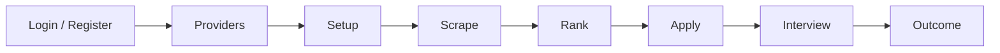

# 🚀 Career OS — Frontend

> El panel web de **Career OS**, una pequeña "estación de trabajo" para automatizar tu búsqueda de empleo de principio a fin: desde configurar el proveedor de IA hasta hacer seguimiento del resultado de cada postulación.

Este repositorio es **solo el frontend** (Next.js + React + Tailwind). Toda la lógica de negocio vive en un backend HTTP separado al que este cliente llama a través de una API REST.

---

## ✨ ¿Qué es Career OS?

Career OS convierte la búsqueda de trabajo en un **pipeline de 7 pasos**. En lugar de saltar entre pestañas y hojas de cálculo, avanzas por una barra lateral guiada donde cada paso alimenta al siguiente:

1. **Providers** — conectas tu proveedor de IA (OpenAI, Anthropic, NVIDIA NIM, LM Studio, Ollama…).
2. **Setup** — construyes tu perfil de candidat@ (nombre, experiencia, skills, educación…).
3. **Scrape** — lanzas búsquedas de empleo en distintos portales.
4. **Rank** — la IA evalúa qué ofertas encajan mejor contigo y las ordena.
5. **Apply** — a partir de una oferta concreta, se generan CV y carta de presentación.
6. **Interview** — preparación personalizada para la entrevista de esa postulación.
7. **Outcome** — un tracker para no perder de hilo el estado de cada aplicación.

Cada paso marca como "completado" en `localStorage`, así que la barra lateral te muestra el progreso y desbloquea los siguientes pasos de forma natural.

---

## 🧭 Flujo del cliente (cómo se mueve un usuario)



1. **Autenticación.** Al entrar a `/`, la app redirige a `/providers`. El layout del grupo `(app)` comprueba si hay `access_token` en `localStorage`; si no existe, te manda a `/login`. Desde `/login` puedes ir a `/register` para crear cuenta.
2. **Login exitoso.** El backend devuelve un JWT que se guarda en `localStorage` (`lib/auth.ts`). A partir de ahí, todas las peticiones lo adjuntan automáticamente en la cabecera `Authorization: Bearer …` (`lib/api.ts`).
3. **Pipeline guiado.** El `StepSidebar` muestra los 7 pasos. Los pasos completados aparecen con ✓, el actual resaltado, y los futuros en gris hasta que llegues a ellos.
4. **Cada paso es un formulario.** El componente reutilizable `PipelinePage` renderiza el formulario adecuado, hace `POST` al endpoint del backend, refresca la lista de resultados y marca el paso como completado.
5. **Avance.** Al confirmar, el usuario navega al siguiente paso (por ejemplo, de `Scrape` → `Rank`), manteniendo el contexto de lo que ya hizo.

> 💡 La idea es que **nunca tengas que pensar "¿qué toca ahora?"** — la barra lateral siempre te lo dice.

---

## 🗂️ Estructura del proyecto

```
app/
├── layout.tsx              # Layout raíz (metadata + globals.css)
├── page.tsx                # Redirige a /providers
├── (app)/                  # Rutas autenticadas (con sidebar)
│   ├── layout.tsx          # Guard de auth + StepSidebar
│   ├── providers/page.tsx  # Paso 1: configurar proveedor de IA
│   ├── setup/page.tsx      # Paso 2: perfil del candidato
│   ├── scrape/page.tsx     # Paso 3: buscar ofertas
│   ├── rank/page.tsx       # Paso 4: priorizar ofertas
│   ├── apply/page.tsx      # Paso 5: generar CV + carta
│   ├── interview/page.tsx  # Paso 6: prep de entrevista
│   └── outcome/page.tsx    # Paso 7: tracker de resultados
└── (auth)/                 # Rutas públicas
    ├── login/page.tsx
    └── register/page.tsx

components/
├── PipelinePage.tsx        # Formulario reutilizable para los pasos del pipeline
├── StepSidebar.tsx         # Navegación lateral con el progreso
└── ui/                     # Componentes de UI (shadcn/ui)

lib/
├── api.ts                  # Cliente HTTP con auth automática
├── auth.ts                 # Helpers de token (localStorage)
└── utils.ts                # Utilidades (cn, etc.)
```

Los grupos de rutas `(app)` y `(auth)` son una convención de Next.js: los paréntesis no aparecen en la URL, pero permiten tener layouts distintos (uno con sidebar y guard de auth, otro sin él).

---

## 🔌 Conexión con el backend

El frontend no hace nada "pesado": es un cliente HTTP de la API de Career OS.

- **URL base:** se lee de `NEXT_PUBLIC_API_URL` (por defecto `http://localhost:8000`).
- **Autenticación:** JWT en `localStorage` (`access_token`), inyectado en cada petición por `apiFetch`.
- **Endpoints** que consume (todos bajo `/api/v1/`):

  | Paso        | Endpoint principal            | Listado                       |
  |-------------|-------------------------------|-------------------------------|
  | Providers   | `POST /providers/`            | `GET /providers/`             |
  | Setup       | `POST /setup/profile`         | —                             |
  | Scrape      | `POST /scrape/`               | `GET /scrape/jobs`            |
  | Rank        | `POST /rank/`                 | `GET /rank/jobs`              |
  | Apply       | `POST /apply/`                | `GET /apply/`                 |
  | Interview   | `POST /interview/`            | —                             |
  | Outcome     | `POST /outcome/`              | `GET /outcome/tracker/rows`   |
  | Auth        | `POST /auth/login`            | `POST /auth/register`         |

> ⚠️ Necesitas tener el backend de Career OS corriendo para que el frontend funcione. Sin backend, verás errores de red en los formularios.

---

## 🛠️ Stack técnico

- **Next.js 15** (App Router) + **React 19**
- **TypeScript** estricto
- **Tailwind CSS v4** + **shadcn/ui** para los componentes
- **lucide-react** para iconos
- **pnpm** como gestor de paquetes

---

## 🚀 Puesta en marcha

### Requisitos previos

- Node.js 20+
- [pnpm](https://pnpm.io) instalado (`npm i -g pnpm`)
- El backend de Career OS corriendo (por defecto en `http://localhost:8000`)

### Instalación

```bash
pnpm install
```

### Variables de entorno

Crea un archivo `.env.local` en la raíz:

```bash
NEXT_PUBLIC_API_URL=http://localhost:8000
```

### Desarrollo

```bash
pnpm dev
```

Abre [http://localhost:3000](http://localhost:3000). La app te redirigirá a `/providers` y, si no estás loguead@, a `/login`.

### Build y producción

```bash
pnpm build
pnpm start
```

### Lint

```bash
pnpm lint
```

---

## 🧠 Decisiones de diseño

- **Estado en el cliente.** El progreso del pipeline se guarda en `localStorage` (`completed_steps`), así que sobrevive a recargas sin necesidad de backend extra.
- **Un solo componente para los 7 pasos.** `PipelinePage` recibe `fields`, `endpoint` y `listEndpoint`, lo que mantiene cada página en ~5 líneas y evita duplicación.
- **Guard de auth simple.** El layout de `(app)` comprueba el token antes de renderizar; si falta, redirige a `/login`. No hay middleware de servidor (aún).
- **Grupos de rutas.** `(app)` y `(auth)` separan layouts sin afectar a las URLs.

---

## 📝 Notas

- Este proyecto se creó con `create-next-app` y usa `next/font` para la fuente Geist.
- El frontend asume que el backend sigue el contrato de endpoints listado arriba. Si la API cambia, hay que actualizar `lib/api.ts` y las páginas correspondientes.

---

Hecho con ☕ y bastante Tailwind.
